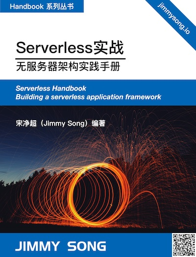

# Serverless Handbook——无服务架构实践手册

Serverless（无服务器架构）是指服务端逻辑由开发者实现，应用运行在无状态的计算容器中，由事件触发，完全被第三方管理，其业务层面的状态则存储在数据库或其他介质中。

Serverless 是云原生技术发展的高级阶段，可以使开发者更聚焦在业务逻辑，而减少对基础架构的关注。

## 关于本书

  

  

本书是本人学习和实践 Serverless 过程中所整理的资料，主要关注的 Serverless 开源项目是 [Knative](https://github.com/knative)。

### 使用方式

您可以通过以下方式使用本书：

- GitHub地址：https://github.com/rootsongjc/serverless-handbook
- GitBook 在线浏览：https://jimmysong.io/serverless-handbook/

## License

  

[署名-非商业性使用-相同方式共享 4.0 (CC BY-NC-SA 4.0)](https://creativecommons.org/licenses/by-nc-sa/4.0/deed.zh)